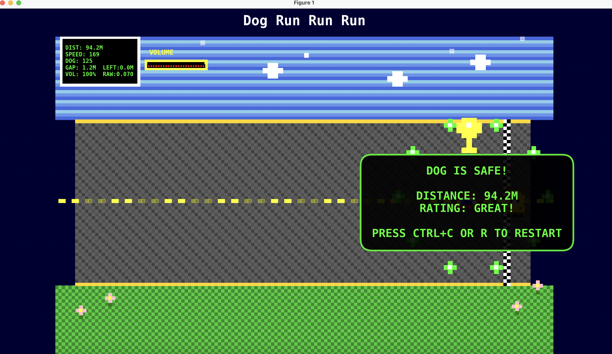
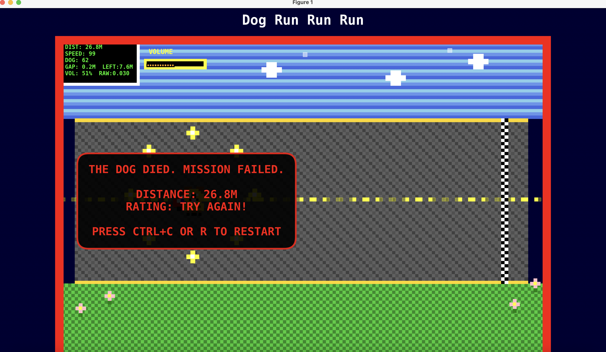

# Pixel Dog Run (Audio Game)

> Inspiration
>
> While walking on the street, I sometimes see stray dogs nearly getting hit by cars. It’s heartbreaking. So I made this game where you help a little dog run faster and get away from danger.

## Overview

Pixel Dog Run is an 8-bit style, sound-controlled chasing game. You are protecting a small dog from a car behind it. The louder your voice, the faster the dog runs. The car accelerates over time, so you need to keep the dog moving and reach the finish line safely.

- Platform: Python + Matplotlib + PyAudio (real-time audio)
- Style: Pixel-art visuals and retro feel
- Modes:
  - Core game: `Pixel_Dog_Run.py`
  - Face-avatar launcher: `pixel_car_chase_dog_face_avatar.py` (capture/pixelate your face and show it in-game)

## How to Play

- Louder voice/sound → dog moves faster
- Quiet → dog moves slowly
- The car always speeds up over time
- Goal: let the dog reach the checkered finish line safely
  
  

- If the car catches the dog: "THE DOG DIED. MISSION FAILED."
  
  

HUD shows:
- Distance (score)
- Car speed and dog speed
- Gap (distance between car and dog)
- Remaining distance to the finish line
- Volume bar (0–100%) with pixel-style segments

## Quick Start

1. Create and activate a virtual environment (recommended).
2. Install dependencies (PyAudio can be tricky on macOS; use the provided requirements files if needed).

Common sets in this repo:
install manually:
  - numpy
  - matplotlib
  - pyaudio
  - opencv-python (only required for the face-avatar launcher)

Run the game:
- Basic game:
  - Python: `Audio_Game/Pixel_Dog_Run.py`
- With face avatar (webcam capture first):
  - Python: `Audio_Game/pixel_car_chase_dog_face_avatar.py`

On macOS with a virtual environment, for example:
- Run core game from project root
  - `./.venv/bin/python Audio_Game/Pixel_Dog_Run.py`
- Run face-avatar launcher
  - `./.venv/bin/python Audio_Game/pixel_car_chase_dog_face_avatar.py`

If PyAudio errors occur on the system Python, use the repo's virtual environment where PyAudio is installed.

## Controls & Difficulty

- Controls
  - Restart (after game over): Ctrl+C
  - Tip: if keys don’t respond, click the game window once to focus it

- Difficulty & tuning
  - Audio sensitivity is tuned to ignore small background noise
  - Dog speed grows sublinearly with volume so it feels stable
  - The car has an early acceleration phase and a stronger late-game phase
  - You can tweak difficulty in `Pixel_Dog_Run.py`:
    - Audio sensitivity: `volume_threshold`, `max_volume`, `volume_history` length
    - Dog speed: `dog_min_speed`, `dog_max_speed`, `dog_speed_exponent`
    - Car speed: `min_car_speed`, `max_car_speed`, `car_accel`, `late_car_accel`, `late_game_frames`

## Face Avatar Mode

`pixel_car_chase_dog_face_avatar.py` will:
- Open the webcam and detect your face (press C to capture, Q to quit)
- Pixelate the face into a small avatar
- Show the avatar in the top-right of the game screen with a pixel-style border
- If the camera is unavailable, it falls back to selecting an image from your computer

Tips on macOS:
- If the camera doesn’t open, check System Settings → Privacy & Security → Camera permissions for Terminal/VS Code/Python
- If audio input can’t be found, ensure "Microphone" access is allowed

## Known Behaviors

- First second uses a small ramp to avoid a sudden car jump
- Volume bar is outlined and anti-aliasing disabled for crisp pixel look
- Finish line is a checkered pattern; reaching it triggers a success overlay

## Troubleshooting

- PyAudio missing: install inside the project virtual env
- Input device errors: ensure a microphone is available and not used by another app
- Webcam errors: ensure permissions are granted; try the image fallback
- Ctrl+C doesn’t restart: use in-window keys (R/Enter/Space) after you see the game-over overlay; make sure the window is focused
- No movement from audio: raise your voice above the threshold; adjust `volume_threshold` or `max_volume` in the code if needed

## License

This project is for educational purposes. Visuals are original pixel art constructed procedurally. Feel free to adapt with attribution.
