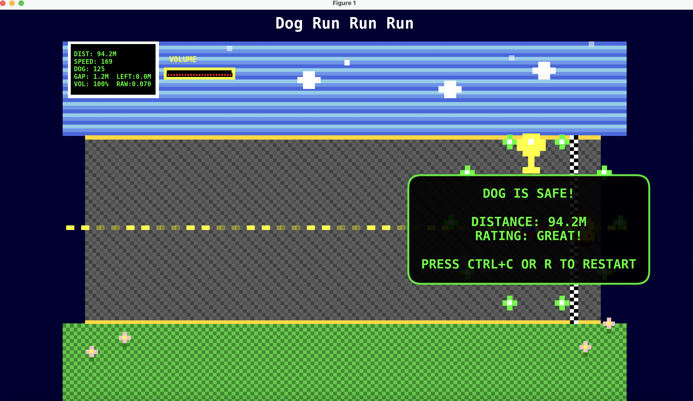
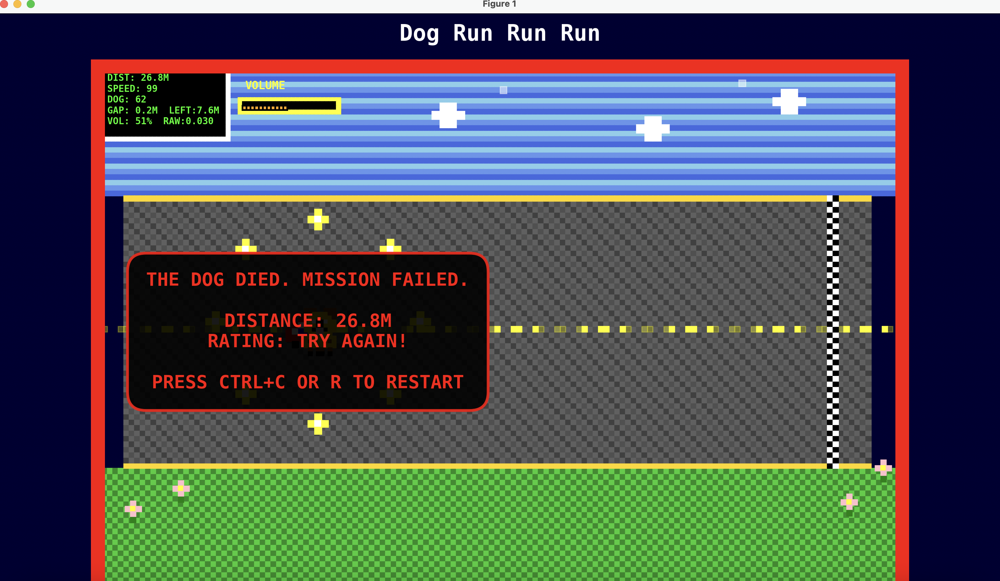

# Interactive Experience Assignment 3

This repository contains two interactive projects:

- Audio_Game — a retro pixel-art, microphone-driven chase game
- Website_AI — a Streamlit app called "Snoopy's Playground" with Chat/Music/Video/Game/Article/Fortune tabs

## Repository Structure

```
Interactive_Experience_Assignment3/
├── Audio_Game/          # Pixel Dog Run game (Matplotlib + PyAudio)
│   ├── Pixel_Dog_Run.py
│   ├── pixel_car_chase_dog_face_avatar.py
│   ├── README.md
│   └── images/
│       ├── Win.png      # success overlay screenshot
│       └── Fail.png     # failure overlay screenshot
└── Website_AI/          # Streamlit app (LM Studio compatible)
    ├── lmstudio_chatbot_tabs.py
    ├── README.md
    └── assets/
        └── background.jpg (optional)
```

## Quick Start

### 1) Audio Game (Pixel Dog Run)

- Idea: Your voice controls the dog's speed; the car accelerates over time. Help the dog reach the checkered finish line safely.
- Entry: `Audio_Game/Pixel_Dog_Run.py`
- Optional launcher with avatar: `Audio_Game/pixel_car_chase_dog_face_avatar.py`

Run (from repo root):

```bash
./.venv/bin/python Audio_Game/Pixel_Dog_Run.py
```

Controls
- Louder voice → dog runs faster
- After game over: R / Enter / Space / Ctrl+C to restart; Q / Esc to quit

Screenshots





Troubleshooting
- If PyAudio fails on system Python, use the repo venv; allow microphone permission on macOS
- Tune sensitivity in code: `volume_threshold`, `max_volume`, `volume_history`

### 2) Website AI (Snoopy's Playground)

- Entry: `Website_AI/lmstudio_chatbot_tabs.py`
- Features: Chat (multiple personas), Music (local playback), Video embedding, Mini-game, Fortune, Article writer

Run (from repo root):

```bash
./.venv/bin/python -m streamlit run Website_AI/lmstudio_chatbot_tabs.py
```

LM Studio settings (in sidebar)
- Server URL: `http://localhost:1234/v1`
- API Key: `lm-studio`
- Model: e.g. `lmstudio-community/Meta-Llama-3-8B-Instruct-GGUF`

Tips
- Background customization in sidebar (image/fit/opacity, default 70%)
- Install `watchdog` for faster Streamlit reloads

## Development

- Python 3.9+
- Recommended: use a virtual environment and install per-app requirements as needed

## License

Educational use; feel free to adapt with attribution.
